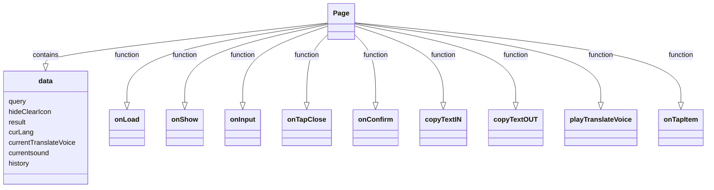
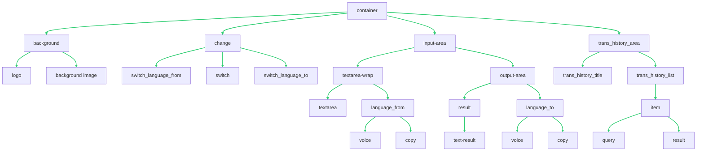

# 1. 项目概述

## 1.1 项目基本介绍

<div align="center">
    
</div>
<div align = "center">
	<h1 align = "center">TransWe</h1>    
    <h4 align = "center">Translate WeChat Mini Program</h4>
    简体中文
	&nbsp;&nbsp;| &nbsp;&nbsp;
	<a href="https://github.com/dekrt/TransWe/blob/main/README-en.md">English</a>
    <br>
    <br>
    <a href = "https://dekrt.cn/"></a>
    
    <a href = "https://github.com/dekrt/TransWe"></a>
    <a href = "https://github.com/dekrt/TransWe/issues"></a>
</div>

## 📱 UI界面

<div align = "center">
    
    
    
    
    
</div>


## 📖 项目介绍

**TransWe**意为`Translation+Wechat`，是一个功能强大的机器翻译微信小程序，它能够通过后台机器翻译服务快速、准确地翻译各种语言。它还支持第三方OCR、语音识别和语音合成集成，为用户提供更便捷、高效的翻译服务。

TransWe功能包括：

1. 机器翻译：TransWe使用后台机器翻译服务，支持多种语言翻译，包括英语、中文、法语、德语、日语、韩语等，能够准确、快速地翻译用户的文本。
2. OCR识别：TransWe支持第三方OCR识别，用户只需要上传图片或拍摄照片，就能将图片中的文字转换为文本进行翻译。
3. 语音识别：TransWe支持第三方语音识别，用户只需要录制音频，就能将音频中的语音转换为文本进行翻译。
4. 语音合成：TransWe支持第三方语音合成，用户能够将翻译结果通过语音合成功能转换为语音输出，提高用户的交互体验。

TransWe使用简单，功能强大，只需选择需要翻译的语言，输入要翻译的文本，点击“翻译”按钮，TransWe将自动完成翻译，如果需要使用OCR识别、语音识别或语音合成功能，可以选择相应功能按钮，按照提示进行操作即可。同时TransWe还是一款完全免费的小程序，旨在为用户提供更便捷、高效的翻译服务。无论是旅行、学习还是工作，TransWe都能帮助用户轻松应对语言难题。

## 🤝 项目成员

<div>
    <a href="https://github.com/dekrt"></a>
    <a href="https://github.com/chendeting88"></a>
</div>

`TransWe`由**张骁凯**和**陈德霆**共同开发完成。

## 🚀 功能特性

**TransWe**是一款集多种功能于一身的微信小程序，旨在为用户提供便捷、高效的翻译服务。以下是TransWe的主要功能特性：

1. **多语言机器翻译**：TransWe支持多种语言的翻译，包括但不限于英语、中文、法语、德语、日语、韩语等。我们的后台机器翻译服务能够快速、准确地翻译用户的文本，满足用户在不同场景下的翻译需求。
2. **OCR识别**：TransWe集成了第三方OCR识别技术，用户只需上传图片或拍摄照片，我们的小程序就能将图片中的文字识别出来，转换为文本进行翻译。这一功能特别适用于处理图片中的外语文字，极大地提高了用户的翻译效率。
3. **语音识别**：TransWe支持第三方语音识别技术，用户只需录制音频，我们的小程序就能将音频中的语音识别并转换为文本进行翻译。这一功能使得用户在无法输入文字时，仍然可以轻松获取翻译服务。
4. **语音合成**：TransWe集成了第三方语音合成技术，用户可以将翻译结果转换为语音输出，提高了用户的交互体验，特别适用于视力不便或者需要听力辅助的用户。

TransWe的使用非常简单，用户只需选择需要翻译的语言，输入要翻译的文本，我们的小程序就会自动完成翻译。如果用户需要使用OCR识别、语音识别或语音合成功能，只需选择相应的功能按钮，按照提示进行操作即可。

TransWe是一款完全免费的小程序，我们的目标是为用户提供最便捷、高效的翻译服务。无论是旅行、学习还是工作，TransWe都能帮助用户轻松应对语言难题，让语言交流变得无障碍。

## 🧱 目录结构描述

```
.
├─code                              //代码文件夹
│  ├─assets							//外部工具
│  │  └─iconfont					//矢量图库
│  ├─components					    //组件文件夹
│  │  ├─bottom-button				//录音按钮
│  │  ├─modal						//复制按钮
│  │  ├─play-icon					//组件动画
│  │  ├─result-bubble				//翻译气泡
│  │  └─waiting-icon				//等待图标
│  ├─imgs						    //小程序内部图片文件夹
│  ├─pages							//所有页面
│  │  ├─change					    //切换语言
│  │  ├─choose_language			    //选择语言
│  │  ├─edit					    //文本编辑页面
│  │  ├─getPic					    //获取图片
│  │  ├─history						//翻译历史
│  │  ├─history_test				//翻译历史前端测试
│  │  ├─index						//主页
│  │  ├─index_test					//主页前端测试
│  │  ├─OCR							//拍照翻页界面
│  │  └─voice_translation			//语音翻译界面
│  ├─TDD_test_cdt					//TDD开发语音翻译
│  ├─TDD_test_zxk					//TDD开发文本翻译
│  └─utils							//插件
│      api.js						//翻译api接口
│      conf.js						//翻译配置
│      md5.min.js					//获取MD5加密
│      util.js						//获取时间配置
├─docs								//所有文档
│      API.md						//API接口文档
│      CurriculumDesignReport.md	//课设报告文档
│      SystemArchitecture.md		//系统架构文档
│      SystemDesign.md				//系统设计文档
│      SystemRequirement.md			//系统需求文档
│      UI_Design.md					//UI设计文档
│      UserRequirement.md			//用户需求文档
└─pics								//图片
```

## ⬇️ 版本内容更新

- **2023/06/02 TransWe v1.0**: 基本实现全部功能

## 📃 协议

 [](https://github.com/dekrt/TransWe/blob/main/LICENSE)

>**警告**
>
>除GPLv3许可下的源代码外，其他方均禁止使用TransWe的名义作为下载器应用，TransWe的衍生产品亦同。
>衍生品包括但不限于分叉和非官方构建。


## 1.2 Github仓库地址

[TransWe](https://github.com/dekrt/TransWe): <https://github.com/dekrt/TransWe>

## 1.3 人员基本分工

### 1.3.1 **张骁凯**（负责人）：

张骁凯将主要负责项目的后端开发工作，包括但不限于：

1. 负责Github仓库管理：
2. 将需求作为Issue录入：
3. 
4. **机器翻译服务**：负责与后台机器翻译服务的接口开发和维护，确保翻译服务的准确性和效率。
5. **数据库管理**：负责数据库的设计和管理，确保用户数据的安全和完整。
6. **性能优化**：负责系统的性能优化，确保系统在高并发情况下的稳定运行。

### 1.3.2 **陈德霆**（副负责人）：

陈德霆将主要负责项目的前端开发和用户体验设计，包括但不限于：

1. **用户界面设计**：负责用户界面的设计和开发，确保用户界面的易用性和美观性。
2. **OCR和语音识别功能**：负责OCR识别和语音识别功能的集成和测试，确保这些功能的正常运行。
3. **用户反馈**：负责用户反馈功能的开发，收集用户的反馈和建议，以便持续改进我们的产品。

# 2. 需求描述

## 2.1 功能性描述

### 2.1.1 用户需求

#### 1 集成翻译服务（Translation Service）

1. 用户需求：

- 用户在输入框中输入文字，选择输入语言与目标语言，程序在输出框中给出翻译结果。

2. 用户需求标识：**TransWe-UR-TS**

#### 2 集成第三方OCR功能（Optical Character Recognition）

1. 用户需求：

- 用户可以选择使用图片转文字服务（OCR），并进行拍照（或选择图库中的图片）进行翻译。

2. 用户需求标识 ：**TransWe-UR-OCR**

#### 3 集成第三方语音识别(Speech Recognition):

1. 用户需求：

- 用户选择输入语言及目标语言，通过语音进行输入，程序以文字形式展示输入结果与翻译结果。

2. 用户需求标识：**TransWe-UR-SR**

#### 4 集成第三方语音合成（Speech Synthesis）

1. 用户需求：

- 用户在翻译完成后点击发声按钮，程序将翻译结果以语音的形式进行输出。

2. 用户需求标识：**TransWe-UR-SS**

### 2.1.2 系统需求

#### 1 基础翻译功能（TransWe-SR-TS）

1. **初始假设：** 

-  用户在输入框中输入文字，选择输入语言与目标语言，程序在输出框中给出翻译结果。

2. **正常状态：** 

-  用户在输入框中输入待翻译的文本，**程序会自动检测输入语言**，用户在下拉菜单中选择相应的目标语言。
-  用户也可以**手动选择输入语言**。输入完成后，程序将进行翻译并在输出框中显示翻译结果。

3. **有哪些会出错：**

- 输入的文本中包含无法识别的字符或语言。程序会提示用户重新输入或手动选择语言。 
- 输入的文本过长或复杂，程序无法进行翻译。程序会提示用户缩短输入文本或尝试其他翻译方式。
- 网络连接不稳定，程序无法进行翻译。程序会提示用户检查网络连接并重试。

4. **其他活动：**

- 用户可以在下拉菜单中选择默认语言，程序会在下一次启动时自动选择该语言。
- 程序会记录用户的翻译历史，并允许用户在历史记录中查看以前的翻译结果。 

5. **完成的系统状态：** 

- 用户可以通过打开程序，并进入翻译界面来进行翻译。程序会自动检测输入语言，并在下拉菜单中选择相应的目标语言。
- 用户在输入框中输入待翻译的文本后，程序会进行翻译并在输出框中显示翻译结果。
- 程序记录了用户的翻译历史，并允许用户在历史记录中查看以前的翻译结果。

#### 2 集成第三方OCR功能的脚本（TransWe-SR-OCR）

1. **初始假设：** 

- 用户需要使用一个微信翻译小程序，该小程序集成了第三方OCR功能，用户可以通过拍照或上传照片将图片中的待翻译文本识别成目标语言并显示到图片上。

2. **正常状态：** 

- 用户打开小程序，选择OCR功能，进入拍照界面。用户可以**使用手机摄像头拍下待识别的图片**，也可以**按下图库按钮上传照片**。进入图片编辑界面后，**用户可以选择整张图片或者框选一部分图片**，用户需要选择待翻译的语言种类和目标语言种类。检测到用户按下翻译按钮时，系统应该调用OCR服务对目标图片进行文字识别，并在界面上显示识别结果。

- 系统应该允许用户在翻译后重新选择图片，重新选择翻译语言并进行翻译。

3. **有哪些会出错：**

- 系统权限不足，无法访问用户图库。
- 第三方OCR功能出现故障，导致无法完成文字识别。

4. **其他活动：**

- 系统应该保证用户隐私，不记录用户的OCR识别记录。
- 系统应该对用户图库进行保护，确保不被未授权的其他脚本访问。

5. **完成的系统状态：** 

- 用户可以通过OCR功能成功识别图片中的文字并进行翻译。

#### 3 语音识别功能（TransWe-SR-SR）

1. **初始假设：** 

- 用户希望通过语音输入来输入翻译内容，系统需要进行语音识别功能，将语音转换为文本，再进行翻译操作。

2. **正常状态：** 

- 用户点击语音输入按钮，系统开始录音并将录音转换为文本格式，并输出到屏幕上。 
- 系统对文本**进行分词**并进行翻译操作。
- 翻译结果以文本形式**呈现在界面上**。

3. **有哪些会出错：**

- 语音输入的质量不好，无法被识别成文本。系统应该提示用户录音质量不好，请重试。 
- 翻译服务不可用或异常。系统应该提示用户翻译服务暂时不可用，请稍后再试。

4. **其他活动：**

- 系统应该保证用户隐私，不记录用户的语音输入内容。
- 系统应该对录音文件进行保护，确保不被未授权的人访问。

5. **完成的系统状态：** 

- 用户可以通过语音输入方式进行翻译操作。
- 系统可以对语音进行识别并将其转换为文本格式。 
- 系统可以对文本进行分词和翻译操作，将翻译结果呈现在界面上。

#### 4 语音合成功能（TransWe-UR-SS）

1. **初始假设：** 

- 用户希望通过语音的形式来输出翻译内容，系统需要进行语音合成功能，将文本转换为语音，再通过扬声器播放。

2. **正常状态：** 

- 用户正常进行翻译后，点击语音输出按钮，系统开始进行语音合成并将翻译结果以**语音的形式进行输出**。
- 翻译结果以**文本形式呈现**在界面上。

3. **有哪些会出错：**

- 系统语音合成功能出现故障，无法将文本正确转换为语音。
- 扬声器或音频设备出现故障，无法正常播放语音。

4. **其他活动：**

- 当正在播放合成的语音时，图标的颜色将会改变；播放完成后回到原来的颜色。

5. **完成的系统状态：** 

- 用户可以通过语音输入并输出翻译内容，系统可以将文本转换为语音，并通过扬声器播放出来。系统记录了用户的输入和输出内容，并可以对其进行分析和统计。

## 2.2 非功能性需求

### 1 **性能需求**：

- 翻译响应时间：对于用户输入的文本，系统应在1秒内返回翻译结果。
- OCR识别和语音识别的处理时间：对于用户上传的图片或音频，系统应在5秒内完成识别并返回结果。
- 系统应能够支持高并发请求，即在用户量剧增的情况下，系统的性能不会显著下降。

### 2 **安全性需求**：

- 用户的个人信息和使用数据应得到充分保护，不得泄露给第三方。
- 系统应具备防止恶意攻击的能力，如DDoS攻击、SQL注入等。

### 3 **可用性需求**：

- 系统的正常运行时间应达到99.9%。
- 在出现故障时，系统应能在1小时内恢复正常。

### 4 **可维护性需求**：

- 系统应具备良好的模块化和文档化，以便进行维护和升级。
- 系统应能够容易地添加新的语言支持和新的功能。

### **5 可扩展性需求**：

- 系统应设计成可扩展的架构，以便在未来可以添加更多的功能，如多语言支持、语音翻译等。

### 6 **用户体验需求**：

- 系统的用户界面应简洁易用，用户能够快速理解如何使用各项功能。
- 系统应提供用户反馈功能，用户可以方便地报告问题和提出建议。

# 3.  **系统设计**

## 3.1 **架构设计**

我们的翻译小程序采用分层架构的架构模式，架构示意图如下：


### 1 表示层（Presentation Layer）

表示层是用户与系统交互的界面，包括用户界面、数据输入、输出等。这一层主要负责将用户请求传递给下一层，并将处理结果返回给用户。在我们的翻译软件中，表示层包括用户输入文本的界面、显示翻译结果的界面、对翻译结果进行输出的页面等，以及获取用户的授权信息。

### 2 应用层（Application Layer） 

应用层是系统的核心层，它实现了翻译的核心算法和业务逻辑，包括文本处理、翻译算法等。这一层主要负责接收并处理表示层传递的请求，然后调用其他层的服务，最后将处理结果返回给表示层。在我们的小程序中，应用层负责：

1. 获取用户输入：
   - 手动输入
   - OCR识别
   - 语音输入
2. 获取输出结果：
   - 文本输出
   - 语音合成输出

### 3 服务层（Service Layer） 

服务层为应用层提供支持，包括网络通信、数据访问、存储等服务。这一层主要负责处理数据的存储和访问，以及与其他系统的交互。在我们的翻译软件中，服务层可以包括调用翻译接口获取翻译结果、调取OCR接口获取OCR识别结果、调取语音合成API对翻译结果进行语音输出等。

总的来说，以上三个层级构成了一个完整的翻译软件系统，每个层级都负责不同的功能，各司其职。这种分层架构模式使得系统更加清晰、易于扩展和维护。

## 3.2**界面原型设计**

### 1. 主页面（Main Page）

主页是小程序的入口，包括小程序的基本信息和主要功能模块。页面包含四个模块，分别是文字翻译，录音按钮、OCR翻译按钮和翻译历史记录。

- **文本输入框**：用户可以在这个框中手动输入需要翻译的文本。
- **翻译框**：用户输入文本、点击这个按钮开始翻译。
- **语音播放器**：用户点击播放语音。
- **语言选择器**：用户可以在这里选择源语言和目标语言。
- **语音按钮**：用户可以点击这个按钮，跳转到语音翻译页面。
- **OCR按钮**：用户可以点击这个按钮，跳转到语音OCR页面。
- **翻译历史按钮**：用户可以点击这个按钮，跳转到翻译历史页面。

### 2.语言选择页（Settings Page）

语言选择页提供用户多种翻译语言。用户可以选择支持的语言。

- **语言设置**：用户可以在这里更改默认的源语言和目标语言。

### 3.语音翻译页（Voice Translation Page）

语音翻译页是用户输入需要翻译的语音的页面。页面主要包括录音按钮、语言选择器和翻译结果框。翻译结果框会以卡片形式保存下来，用户可以编辑录入的文字。

- **录音按钮**：位于页面下方，用户可以点击此按钮开始进行语音输入，输入的语音将被实时转化为文字并显示在结果框内。
- **语言选择器**：位于页面顶部，用户可以在此一键切换中英文。
- **翻译结果框**显示用户录音输入的文字以及翻译结果。翻译结果以卡片形式保存并展示，每个卡片包括原文和译文，用户可以删除不要的卡片。
- **编辑按钮**：每个翻译结果卡片右上角都会有一个编辑按钮，用户点击后可以对录入的文字进行编辑，编辑完成后翻译结果将自动更新。
- **返回按钮**：页面左上角有一个返回按钮，用户点击后可以返回主页面。

### 4.OCR拍照翻译页面（OCR  Translation Page）

OCR拍照翻译页面是用户能够通过拍照进行翻译的地方。

- **拍照按钮**：用户可以点击这个按钮，利用手机相机进行拍摄，完成拍摄后，系统会自动进行识别并将图片中的文字进行翻译。
- **翻译结果展示区**：系统完成翻译后，翻译结果将会在这个区域显示，用户可以查看翻译结果。

### 5.翻译历史页（Translation History Page）

翻译历史页面保存用户之前的文字翻译和语音翻译记录。

- **翻译历史**：用户可以划动屏幕查询所有的本地翻译记录。每条历史以卡片形式保存并展示，每个卡片包括原文和译文。

## 3.3 **详细设计**

### 3.3.1. 组件设计

<div align = "center">
    
</div>


### 3.3.2. 组件接口设计

#### 1 数据库接口

<div align = "center">
    
</div>


- `saveTranslationRecord(record: TranslationRecord): void`：保存翻译记录。
- `getTranslationRecords(userId: String): List<TranslationRecord>`：获取指定用户的翻译记录列表。

#### 2 语言设置接口


<div align = "center">
    
</div>


- `sourceLanguage: String`：源语言属性。
- `targetLanguage: String`：目标语言属性。
- `setSourceLanguage(sourceLanguage: String): void`：设置源语言。
- `setTargetLanguage(targetLanguage: String): void`：设置目标语言。
- `getSourceLanguage(): String`：获取源语言。
- `getTargetLanguage(): String`：获取目标语言。

#### 3 OCR翻译接口


<div align = "center">
    
</div>


- `recognizeImage(image: ImageData, sourceLanguage: String, targetLanguage: String): String`：将图像数据识别为文本，并将其翻译成指定的目标语言。

#### 4 语音翻译接口


<div align = "center">
    
</div>


- `recognizeSpeech(audio: AudioData, sourceLanguage: String, targetLanguage: String): String`：将音频数据识别为文本，并将其翻译成指定的目标语言。

#### 5 文本翻译接口


<div align = "center">
    
</div>


- `translateText(text: String, sourceLanguage: String, targetLanguage: String): String`：将指定的文本翻译成指定的目标语言。

#### 6 用户界面接口


<div align = "center">
    
</div>


- `showTextInputBox(): void`：显示文本输入框。
- `showTranslationResult(text: String): void`：显示翻译结果。
- `showVoiceInputButton(): void`：显示语音输入按钮。
- `showOCRButton(): void`：显示 OCR 按钮。
- `showHistoryButton(): void`：显示历史记录按钮。
- `showVoiceAndCopy(): void`：显示语音合成和复制按钮。

#### 7 语音录入接口


<div align = "center">
    
</div>


- `getVoice(text: String, targetLanguage: String): AudioData`：将指定的文本转换为语音，并返回音频数据。
- `copyText(text: String): void`：将指定的文本复制到剪贴板。

#### 8 页面控制接口

<div align = "center">
    
</div>


- `+getToPage(page: String)`：表示该接口具有一个公共方法 `getToPage`，该方法接受一个参数 `page`，类型为 `String`，用于获取指定页面的内容。

#### 9 API信息配置接口

<div align = "center">
    
</div>


- `-api_config: ApiConfig`：表示该接口具有一个私有属性 `api_config`，其类型为 `ApiConfig`。私有属性只能在该类内部访问。
- `+setApiConfig(api_config : ApiConfig)`：表示该接口具有一个公共方法 `setApiConfig`，该方法接受一个参数 `api_config`，类型为 `ApiConfig`，用于设置 `api_config` 的值。
- `+getApiConfig(): ApiConfig`：表示该接口具有一个公共方法 `getApiConfig`，该方法返回 `api_config` 的值，类型为 `ApiConfig`。

#### 10 翻译记录

<div align = "center">
    
</div>


- `userId: String`：用户 ID 属性。
- `sourceText: String`：源文本属性。
- `sourceLanguage: String`：源语言属性。
- `targetText: String`：目标文本属性。
- `targetLanguage: String`：目标语言属性。
- `timestamp: DateTime`：时间戳属性。
- `getUserId(): String`：获取用户 ID。
- `getSourceText(): String`：获取源文本。
- `getSourceLanguage(): String`：获取源语言。
- `getTargetText(): String`：获取目标文本。
- `getTargetLanguage(): String`：获取目标语言。
- `getTimestamp(): DateTime`: 获取时间戳。

### 3.3.3 系统流程分析


<div align = "center">
    
</div>


结合上述用例图，我们得出以下的时序图：

#### 1 文本翻译时序图

<div align = "center">
    
</div>


#### 2 拍照翻译时序图

<div align = "center">
    
</div>


#### 3 语音翻译时序图

<div align = "center">
    
</div>


#### 4 语音合成时序图

<div align = "center">
    
</div>
​           

#### 5 查看翻译历史时序图

<div align = "center">
    
</div>
# 4. 系统实现和测试

## 4.1 系统实现

> 开发语言：Html(Wxml) + Css(Wxss) + javascript；
>
> 开发框架：微信原生框架 + Less
>
> 开发环境：微信开发者工具 + Vscode

### 4.1.1 assets/

### 4.1.2 components/

### 4.1.3 imgs/

包含微信小程序内部需要用到的静态图片。

### 4.1.4 pages/

#### 4.1.4.3 pages/getPic

##### 1 getPic.js

这段代码的主要功能是：

1. 拍照：用户可以点击按钮触发`takeShot`方法，调用微信的摄像头接口进行拍照，拍照成功后，会将图片转换为base64格式，并保存到全局变量中，然后跳转到OCR页面。
2. 提示：用户可以点击按钮触发`onTap`方法，显示一个“只支持中译英”的提示。

```javascript
// 引入api模块，该模块可能包含了一些工具函数
var api = require("../../utils/api.js");

// 获取全局的app实例
const app = getApp();

// 定义一个页面
Page({
  // 页面的初始数据
  data: {

  },

  // 定义一个方法，用于拍照
  takeShot: function () {
    // 创建一个摄像头的上下文
    const ctx = wx.createCameraContext()

    // 使用上下文来拍照
    ctx.takePhoto({
      // 设置图片质量为高
      quality: 'high', // 上传图片进行文字提取时，图片转换为base64后，大小不能超过300k

      // 拍照成功后的回调函数
      success: (res) => {
        // 打印图片的临时地址
        console.log("图片的临时地址为：" + res.tempImagePath);

        // 调用api模块的getPicBase64函数，将图片转换为base64格式
        api.getPicBase64(res.tempImagePath).then(function (res) {
          // 将转换后的base64图片保存到全局数据中
          app.globalData.picBase64 = res.data;

          // 导航到OCR页面
          wx.navigateTo({
            url: '../OCR/OCR',
          })
        })
      }
    })
  },

  // 定义一个方法，用于显示提示
  onTap: function () {
    // 显示一个只支持中译英的提示
    wx.showToast({
      title: '只支持中译英',
      icon: "error"
    })
  }
})
```

##### 2 getPic.json

缺省代码。

```json
{
  "usingComponents": {}
}
```

##### 3 getPic.wxml

这段代码的主要功能是：

1. 头部视图：包含了一个语言切换视图，用户可以点击中文或英文图标和文字来切换语言。
2. 摄像头视图：显示一个摄像头，用户可以通过这个摄像头来拍照。
3. 工具栏视图：包含了一个拍照图标，用户可以点击这个图标来拍照。

```html
<!-- 头部视图 -->
<view class="head">
  <!-- 语言切换视图，点击时触发onTap事件 -->
  <view class="language" bindtap="onTap">
    <!-- 中文图标，点击时触发onTap事件 -->
    <image bindtap="onTap" class="language_pic" src="../../imgs/Chinese.png" />
    <!-- 中文文字，点击时触发onTap事件 -->
    <text bindtap="onTap" class="language_text" decode>&nbsp;中文</text>
    <!-- 切换图标，点击时触发onTap事件 -->
    <image bindtap="onTap" class="switch" src="../../imgs/switch.png"></image>
    <!-- 英文图标，点击时触发onTap事件 -->
    <image bindtap="onTap" class="language_pic" src="../../imgs/English.png" />
    <!-- 英文文字，点击时触发onTap事件 -->
    <text bindtap="onTap" class="language_text" decode>&nbsp;英语</text>
  </view>
</view>

<!-- 摄像头视图 -->
<camera style="margin-top:0rpx;width:100%;height:1100rpx"></camera>

<!-- 工具栏视图 -->
<view class="toolbar">
  <!-- 拍照图标，点击时触发takeShot事件 -->
  <image class="shot" src="../../imgs/takeshot.png" bindtap="takeShot"></image>
</view>

```

##### 4 getPic.wxss

这段CSS样式表的主要功能是：

1. `.head`：设置头部视图的样式，包括位置、大小和背景颜色。
2. `.btn`：设置按钮的样式，包括背景颜色、大小、内边距、颜色、边框圆角、外边距和文本对齐方式。
3. `.toolbar`：设置工具栏的样式，使用Flex布局，设置宽度、高度、主轴对齐方式和交叉轴对齐方式。
4. `.shot`：设置拍照图标的样式，包括大小、文本对齐方式和上外边距。
5. `image`：设置图片的样式，包括大小和垂直对齐方式。
6. `.language`：设置语言切换视图的样式，使用Flex布局，设置上内边距、宽度、左内边距和垂直对齐方式。
7. `.language_pic`：设置语言图标的样式，包括上内边距和垂直对齐方式。
8. `.language_text`：设置语言文字的样式，包括上内边距、字体大小、字体家族、行高、颜色、上下左外边距、字体家族和行高。
9. `.switch`：设置切换图标的样式，使用Flex布局，设置对齐方式、方向、边框圆角、大小和自动外边距。

这些样式主要用于设置微信小程序中的元素样式，使得元素在页面上的布局和外观符合设计要求。

```css
/* 头部视图样式 */
.head {
  position: relative;
  top: 0;
  left: 0;
  width: 100%;
  height: 200rpx;
  background-color: #1493FC;
}

/* 按钮样式 */
.btn {
  background-color: #1493fc;
  width: 200rpx;
  padding: 15rpx 20rpx;
  color: #fff;
  border-radius: 20rpx;
  margin: 40rpx;
  text-align: center;
}

/* 工具栏样式 */
.toolbar {
  display: flex;
  width: auto;
  height: 100rpx;
  justify-content: center;
  align-items: center;
}

/* 拍照图标样式 */
.shot {
  width: 110rpx;
  height: 110rpx;
  text-align: center;
  margin-top: 50rpx;
}

/* 图片样式 */
image {
  width: 30rpx;
  height: 30rpx;
  vertical-align: bottom;
}

/* 语言切换视图样式 */
.language {
  display: flex;
  padding-top: 100rpx;
  width: 300rpx;
  padding-left: 80rpx;
  vertical-align: bottom;
}

/* 语言图标样式 */
.language_pic {
  padding-top: 25rpx;
  vertical-align: text-bottom;
}

/* 语言文字样式 */
.language_text {
  padding-top: 20rpx;
  font-size: 30rpx;
  font-family: Poppins;
  line-height: 26rpx;
  color: #ffffff;
  margin-top: 10rpx;
  margin-bottom: 10rpx;
  margin-left: 10rpx;
  font-family: Poppins;
  line-height: 22rpx;
}

/* 切换图标样式 */
.switch {
  display: flex;
  align-items: center;
  justify-content: flex-start;
  flex-direction: column;
  border-radius: 16rpx;
  width: 72rpx;
  height: 72rpx;
  margin: auto;
}

```

#### 4.1.4.4 pages/history

##### 1 history.js

这段代码的主要功能是：

1. 显示历史记录：当页面显示时，会从本地存储中获取历史记录，并显示到页面上。
2. 点击历史记录项：用户可以点击历史记录项，页面会重新加载首页，并将点击的历史记录项的查询参数传递给首页。
3. 清除历史记录：用户可以点击按钮触发`onClearHistory`方法，清除页面数据中的历史记录数组，并清除本地存储中的历史记录。

```javascript
// 引入全局的app实例
const app = getApp()

// 定义一个页面
Page({
  // 页面的初始数据
  data: {
    history: [] // 历史记录数组
  },

  // 页面显示时的回调函数
  onShow: function () {
    // 从本地存储中获取历史记录，并设置到页面数据中
    this.setData({
      history: wx.getStorageSync('history')
    })
  },

  // 点击历史记录项时的回调函数
  onTapItem: function (e) {
    // 重新加载首页，并传递点击的历史记录项的查询参数
    wx.reLaunch({
      url: `/pages/index/index?query=${e.currentTarget.dataset.query}`
    })
  },

  // 清除历史记录的回调函数
  onClearHistory: function () {
    // 将页面数据中的历史记录数组设置为空
    this.setData({
      history: []
    })

    // 清除本地存储中的历史记录
    wx.clearStorage('history')
  },
})

```

##### 2 history.json

缺省代码。

```json
{
  "navigationBarTitleText": ""
}
```

##### 3 history.wxml

这段代码的主要功能是：

1. 显示翻译历史：页面上有一个滚动视图，里面包含了一个历史记录列表视图，列表中的每一项都是一个历史记录项，显示了查询的语言、查询的文本、结果的语言和结果的文本。
2. 清除历史记录：用户可以点击“清除历史记录”文本，触发`onClearHistory`事件，清除历史记录。
3. 查看历史记录：用户可以点击历史记录项，触发`onTapItem`事件，查看历史记录的详细信息。

```html
<!-- 可滚动视图，设置为纵向滚动 -->
<scroll-view scroll-y class="container">
  <!-- 历史记录列表视图 -->
  <view class="history-list">
    <!-- 头部视图 -->
    <view class="header">
      <!-- 标题文本 -->
      <text class="title">翻译历史</text>
      <!-- 清除历史记录文本，点击时触发onClearHistory事件 -->
      <text bindtap='onClearHistory' class="iconfont icon-close">清除历史记录</text>
    </view>
    <!-- 历史记录项视图，遍历历史记录数组，点击时触发onTapItem事件，传递查询参数和语言索引 -->
    <view class="item" wx:for="{{history}}" wx:key="index" bindtap='onTapItem' data-query="{{item.query}}" data-langId="{{item.langIndex}}">
      <!-- 查询视图 -->
      <view class="query">
        <!-- 语言视图 -->
        <view class="language">
          <!-- 语言图标 -->
          <image src="../../imgs/Chinese.png" />
          <!-- 语言文本 -->
          中文
        </view>
        <!-- 查询文本 -->
        {{item.query}}
      </view>
      <!-- 结果视图 -->
      <view class="result">
        <!-- 语言视图 -->
        <view class="language">
          <!-- 语言图标 -->
          <image src="../../imgs/English.png" />
          <!-- 语言文本 -->
          英语
        </view>
        <!-- 结果文本 -->
        {{item.result}}
      </view>
    </view>
  </view>
</scroll-view>

```

##### 4 history.wxss

这些样式主要用于设置微信小程序中的元素样式，使得元素在页面上的布局和外观符合设计要求。具体包括：

1. `.history-list`：设置历史记录列表的样式，使用Flex布局，设置为列方向，设置内边距。
2. `.header`：设置头部视图的样式，使用Flex布局，设置上外边距。
3. `.title`：设置标题文本的样式，设置字体大小和颜色。
4. `.icon-close`：设置清除历史记录图标的样式，设置左外边距为自动，设置字体大小和颜色。
5. `.item`：设置历史记录项的样式，包括上外边距、内边距、背景颜色、边框圆角和阴影。
6. `.item .query`：设置查询视图的样式，包括内边距、底部边框、字体大小、字体家族、行高和颜色。
7. `.item .query .language`：设置查询语言的样式，包括字体大小、字体家族、行高、颜色、上下外边距。
8. `.item .result`：设置结果视图的样式，包括上外边距、内边距、字体大小、字体家族、行高和颜色。
9. `.item .result .language`：设置结果语言的样式，包括字体大小、字体家族、行高、颜色和下外边距。
10. `image`：设置图片的样式，包括宽度、高度和垂直对齐方式。

这些样式主要用于设置微信小程序中的元素样式，使得元素在页面上的布局和外观符合设计要求。

```css
/* 历史记录列表样式 */
.history-list {
  display: flex;
  flex-direction: column;
  padding: 40rpx;
}

/* 头部视图样式 */
.header {
  display: flex;
  margin-top: 100rpx;
}

/* 标题文本样式 */
.title {
  flex: 1;
  font-size: 26rpx;
  color: #8995a1;
}

/* 清除历史记录图标样式 */
.icon-close {
  margin-left: auto;
  color: #aaa;
  font-size: 26rpx;
}

/* 历史记录项样式 */
.item {
  margin-top: 40rpx;
  padding: 0 32rpx;
  background-color: #ffffff;
  border-radius: 16rpx;
  box-shadow: 0px 0px 2rpx #0000000a, 0px 0px 4rpx #0000000f, 0px 8rpx 16rpx #0000000a;
}

/* 查询视图样式 */
.item .query {
  padding: 20rpx;
  border-bottom: solid 2rpx #e7e7e7;
  font-size: 32rpx;
  font-family: Poppins;
  line-height: 50rpx;
  color: #1e3163;
}

/* 查询语言样式 */
.item .query .language {
  font-size: 28rpx;
  font-family: Poppins;
  line-height: 26rpx;
  color: #a8abb0;
  margin-top: 10rpx;
  margin-bottom: 10rpx;
}

/* 结果视图样式 */
.item .result {
  margin-top: 16rpx;
  padding: 20rpx;
  font-size: 32rpx;
  font-family: Poppins;
  line-height: 50rpx;
  color: #1e3163;
}

/* 结果语言样式 */
.item .result .language {
  font-size: 28rpx;
  font-family: Poppins;
  line-height: 26rpx;
  color: #909dbd;
  margin-bottom: 10rpx;
}

/* 图片样式 */
image {
  width: 30rpx;
  height: 30rpx;
  vertical-align: bottom;
}
```

#### 4.1.4.5 pages/index

##### 1 index.js

这段代码的主要功能包括：

1. 用户输入文本进行翻译，翻译结果会保存在历史记录中。
2. 用户可以点击清除图标清除输入的文本和翻译结果。
3. 用户可以复制输入的文本和翻译结果。
4. 用户可以播放翻译的语音。
5. 用户可以查看翻译的历史记录。

以下是代码的流程图：



```javascript
// 引入翻译工具和全局应用实例
import { translate } from '../../utils/api.js'
const app = getApp()
const plugin = requirePlugin("WechatSI")

Page({
  data: {
    query: '', // 用户输入的查询文本
    hideClearIcon: false, // 控制清除图标的显示与隐藏
    result: [], // 翻译结果
    curLang: {}, // 当前选择的语言
    currentTranslateVoice: '', // 当前播放的语音路径
    currentsound: '', // 当前语音合成语言
    history: [] // 翻译历史记录
  },

  // 页面加载时的处理函数
  onLoad: function (options) {
    if (options.query) {
      this.setData({
        query: options.query,
        'hideClearIcon': false // 显示清除图标
      })
    }
  },

  // 页面显示时的处理函数
  onShow: function () {
    this.setData({
      history: wx.getStorageSync('history') // 从本地存储获取历史记录
    })
    if (this.data.curLang.lang !== app.globalData.curLang.lang) {
      this.setData({
        curLang: app.globalData.curLang
      })
      this.onConfirm() // 执行翻译
    }
  },

  // 处理用户输入的函数
  onInput: function (e) {
    this.setData({
      'query': e.detail.value,
      'hideClearIcon': this.data.query.length > 0 ? false : true // 根据输入内容是否为空来决定是否显示清除图标
    })
  },

  // 处理用户点击清除图标的函数
  onTapClose: function () {
    this.setData({
      query: '',
      hideClearIcon: true,
      result: '' // 清除翻译结果
    })
  },

  // 执行翻译的函数
  onConfirm: function () {
    if (!this.data.query) return // 如果查询文本为空，则不执行翻译
    translate(this.data.query, {
      from: 'auto',
      to: this.data.curLang.lang
    }).then(res => {
      this.setData({
        'result': res.trans_result
      })

      // 更新历史记录
      let history = wx.getStorageSync('history') || []
      history.unshift({
        query: this.data.query,
        result: res.trans_result[0].dst,
        from: res.from,
        to: res.to
      })
      history.length = history.length > 10 ? 10 : history.length
      wx.setStorageSync('history', history)
    })
  },

  // 复制输入文本的函数
  copyTextIN: function (e) {
    wx.setClipboardData({
      data: this.data.query,
      success: function (res) {
        wx.showToast({
          title: '复制成功',
        });
      }
    });
  },

  // 复制翻译结果的函数
  copyTextOUT: function (e) {
    wx.setClipboardData({
      data: this.data.result[0].dst,
      success: function (res) {
        wx.showToast({
          title: '复制成功',
        });
      }
     });
  },

  // 播放翻译语音的函数
  playTranslateVoice: function (e) {
    let componentId = e.currentTarget.dataset.id;
    this.setData({
      currentsound: wx.getStorageSync('currentsound') || 'en_US'
    })
    let lto = this.data.currentsound
    let content = (componentId === 'src') ? this.data.result[0].src : this.data.result[0].dst
    plugin.textToSpeech({
      lang: lto,
      content: content,
      success: resTrans => {
        if (resTrans.retcode == 0) {
          this.setData({
            currentTranslateVoice: resTrans.filename,
          })
          let play_path = this.data.currentTranslateVoice
          if (!play_path) {
            console.warn("no translate voice path")
            return
          }
          let audio = wx.createInnerAudioContext()
          audio.src = play_path // 设置音频的源
          audio.play() // 播放音频
          audio.onError((res) => {
            console.log(res.errMsg)
            console.log(res.errCode)
          })

        } else {
          console.warn("语音合成失败", resTrans)
        }
      },
      fail: function (resTrans) {
        console.warn("语音合成失败", resTrans)
      }
    })
  },

  // 跳转到历史记录页面的函数
  onTapItem: function (e) {
    wx.reLaunch({
      url: `/pages/history/history`
    })
  },
})
```

##### 2 index.json

缺省代码。

```json
{}
```

##### 3 index.wxml

这段代码是微信小程序的WXML模板，用于构建用户界面。主要包括以下部分：

1. **container**：这是页面的主容器。
2. **background**：包含logo和背景图片。
3. **change**：这部分包含语言切换部分，用户可以在这里选择翻译的源语言和目标语言。
4. **input-area**：这是用户输入要翻译的文本的地方。输入区域包含一个文本框和一个语音按钮，用户可以通过输入或语音输入文本。
5. **output-area**：这是显示翻译结果的地方。输出区域包含一个文本结果区域和一个语音按钮，用户可以听到翻译的结果。
6. **trans_history_area**：这部分显示用户的翻译历史。用户可以看到他们过去翻译的文本和结果。

这是该代码的框架图：



```html
<!--index.wxml-->
<view class="container">
  <!-- 背景图片和logo -->
  <view class="background">
    <image class="logo" src="../../imgs/logo.png"></image>
    <image class="background" src="../../imgs/background.png"></image>
  </view>

  <!-- 语言切换部分 -->
  <view class="change">
    <navigator url="/pages/choose_language/choose_language" hover-class="navigator-hover">
      <view class="switch_language_from">
        <image class="switch_language_pic" src="{{curLang.src}}" />
        <text class="switch_language_from_text" decode="true">&nbsp;&nbsp;{{curLang.chs}}</text>
        <text class="iconfont icon-down"></text>
      </view>
      <image class="switch" src="../../imgs/switch.png"></image>
      <view class="switch_language_to">
        <image class="switch_language_pic" src="{{curLang.src}}" />
        <text class="switch_language_to_text" decode="true">&nbsp;&nbsp;{{curLang.chs}}</text>
        <text class="iconfont icon-down"></text>
      </view>
    </navigator>
  </view>

  <!-- 输入区域 -->
  <view class="input-area">
    <view class="textarea-wrap">
      <textarea placeholder='请输入要翻译的文本' placeholder-style=' color: #1e3163;line-height: 34rpx;font-size: 36rpx;font-family: Poppins;' bindinput='onInput' bindconfirm='onConfirm' bindblur='onConfirm' value="{{query}}"></textarea>
      <view class="language_from">
        <image class="language_pic" src="../../imgs/Chinese.png" />
        <text class="language_from_text">中文</text>
        <view data-id="src" catchtap="playTranslateVoice" catchtouchstart="playTranslateVoice">
          <image class="voice" src="../../imgs/voice.png" mode="widthFix" />
        </view>
        <view class="copy" bindtap="copyTextIN">
          <image src="../../imgs/copy.png" mode="widthFix" />
        </view>
      </view>
    </view>

    <!-- 输出区域 -->
    <view class="output-area">
      <view class="result">
        <view class="text-result" wx:for="{{result}}" wx:key="index">
          <text selectable="true" decode="true">{{item.dst}}</text>
        </view>
      </view>
      <view class="language_to">
        <image class="language_pic" src="{{curLang.src}}" />
        <text class="language_to_text">{{curLang.chs}}</text>
        <view data-id="tar" catchtap="playTranslateVoice" catchtouchstart="playTranslateVoice">
          <image class="voice" src="../../imgs/voice_white.png" mode="widthFix" />
        </view>
        <view class="copy" bindtap="copyTextOUT">
          <image src="../../imgs/copy_white.png" mode="widthFix" />
        </view>
      </view>
    </view>

        <!-- 翻译历史模块 -->
    <view class="trans_history_area">
      <view class="trans_history_title">
        <view class="trans_history_title_chi">翻译历史</view>
        <view class="trans_history_title_eng">Translation History</view>
      </view>
      <view class="trans_history_list">
        <view class="item" wx:for="{{history}}" wx:key="index" bindtap='onTapItem' data-query="{{item.query}}" data-langId="{{item.langIndex}}">
          <view class="query">
            <view class="language">
              <image src="../../imgs/Chinese.png" />
              中文
            </view>
            {{item.query}}
          </view>
          <view class="result">
            <view class="language">
              <image src="../../imgs/English.png" />
              英语
            </view>
            {{item.result}}
          </view>
        </view>
      </view>
    </view>
  </view>
</view>

```

##### 4 index.wxss

这段代码是微信小程序的WXSS样式表，用于设置页面的样式。主要包括以下部分：

1. **container**：设置页面的主容器的位置、大小和背景颜色。
2. **logo和background**：设置logo和背景图片的位置、大小和显示方式。
3. **change**：设置语言切换部分的样式，包括颜色、字体大小、内外边距、显示方式、对齐方式等。
4. **input-area和textarea-wrap**：设置用户输入要翻译的文本的区域的样式，包括位置、背景颜色、边距、边框、阴影等。
5. **output-area**：设置显示翻译结果的区域的样式，包括显示方式、最小高度、边距、边框、背景颜色、阴影等。
6. **trans_history_area**：设置显示用户的翻译历史的区域的样式，包括边距、标题的样式、列表项的样式等。

```css
.container {
  position: fixed;
  top: 0;
  left: 0;
  width: 100%;
  /* height: 100%; */
  height: 500rpx;
  /* background: linear-gradient(to bottom, #1493FC 40%, #FFFFFF 60%); */
  background: #1493FC;
}

.container .logo {
  position: fixed;
  display: flex;
  margin-top: 20rpx;
  width: 387rpx;
  height: 211rpx;
  left: 20rpx;
  top: 0rpx;
}

.container .background {
  position: fixed;
  display: flex;
  width: 312rpx;

  height: 288rpx;
  right: 0;
  top: 60rpx;
}

.change {
  color: #8995a1;
  font-size: 24 rpx;
  /* padding: 20rpx 40rpx; */
  display: block;
  align-items: center;
  justify-content: space-between;
  margin: 30rpx 50rpx 0;
  margin-top: 220rpx;
  padding: 32rpx 18rpx;
  background-color: #1265dd;
  border-radius: 16rpx;
}

.change .icon-right {
  color: #888;
}

.change .icon-down {
  color: #8995a1;
  font-size: 20rpx;
}

.change .switch_language_from {
  position: fixed;
  display: flex;
  flex-direction: row;
  margin-left: 6rpx;
  top: 265rpx;
  left: 100rpx;
  align-items: center;
  justify-content: center;
}

.change .switch {
  /* display: flex; */
  display: flex;
  align-items: center;
  justify-content: flex-start;
  flex-direction: column;
  border-radius: 16rpx;
  width: 72rpx;
  height: 72rpx;
  margin: auto;
}

.change .switch_language_to {
  position: fixed;
  display: flex;
  flex-direction: row;
  top: 265rpx;
  right: 100rpx;
  align-items: center;
  justify-content: center;
  vertical-align: text-bottom;
}


.input-area {
  position: relative;
}

.textarea-wrap {
  background: #fff;
  margin: 50rpx;
  border-bottom: 1px solid #c7cee0;
  padding: 0 32rpx;
  background-color: #ffffff;
  border-radius: 16rpx;
  box-shadow: 0px 0px 2rpx #0000000a, 0px 0px 4rpx #0000000f, 0px 8rpx 16rpx #0000000a;
  height: 300rpx;
  left: 6.13%;
  right: 6.67%;
  top: 53.72%;
  bottom: 0.55%;
  color: #1e3163;
  line-height: 34rpx;
  font-size: 36rpx;
  font-family: Poppins;
}

.language_from {
  bottom: auto;
  font-size: 30rpx;
  font-family: Poppins;
  line-height: 26rpx;
  color: #a8abb0;
  margin-top: 10rpx;
  margin-bottom: 10rpx;
  font-family: Poppins;
  line-height: 22rpx;
}

.language_pic {
  margin-top: 20rpx;
  width: 40rpx;
  height: 40rpx;
  vertical-align: text-bottom;
}

.language_from_text {
  font-size: 30rpx;
  font-family: Poppins;
  line-height: 26rpx;
  color: #a8abb0;
  margin-top: 10rpx;
  margin-bottom: 10rpx;
  margin-left: 10rpx;
  font-family: Poppins;
  line-height: 22rpx;
}

.input-area textarea {
  background-color: #fff;
  padding: 30rpx 0 30rpx 10rpx;
  /* width: calc(100% - 48rpx); */
  width: auto;
  margin: 0;
  box-sizing: border-box;
  height: 210rpx;
  border-bottom: solid 2rpx #e7e7e7;
  padding-right: 0;

}

.input-area .icon-close {
  position: absolute;
  right: 12rpx;
  top: 20rpx;
  z-index: 100;
  font-size: 40rpx;
  color: #888;
}

.voice {
  position: fixed;
  margin-top: -40rpx;
  width: 40rpx;
  height: 40rpx;
  vertical-align: text-bottom;
  text-align: end;
  right: 150rpx;
}

.copy {
  position: fixed;
  margin-top: -45rpx;
  width: 50rpx;
  height: 50rpx;
  right: 100rpx;
  display: flex;
  align-items: center;
  justify-content: center;
}


.play-icon {
  position: absolute;
  right: 3rpx;
  bottom: 7rpx;
  padding: 0 8rpx;
  display: flex;
  align-items: center;
}

.edit-icon::before .play-icon::before {
  content: "";
  position: absolete;
  top: -10rpx;
  left: -10rpx;
  bottom: -10rpx;
  right: -10rpx;
}


.input-area .output-area {
  display: flex;
  flex-direction: column;
  min-height: 150rpx;
  margin: 50rpx;
  border-bottom: 1px solid #c7cee0;
  padding: 0 32rpx;
  background-color: #1493FC;
  border-radius: 16rpx;
  box-shadow: 0px 0px 2rpx #0000000a, 0px 0px 4rpx #0000000f, 0px 8rpx 16rpx #0000000a;
  height: 300rpx;
  left: 24px;
  right: 24px;
  top: 384px;
  bottom: 262px;
}

.output-area .text-result {
  min-height: 150rpx;
  /* margin-top: 20rpx; */
  /* padding: 20rpx 0; */
  height: 150rpx;
  /* border-bottom: solid 2rpx #e7e7e7; */
  color: #ffffff;
  line-height: 32rpx;
  font-size: 36rpx;
  font-family: Poppins;
  line-height: 33rpx;
}

.output-area .result {
  margin-bottom: 10px;
  /* 这里的值可以根据你的需求来调整 */
  min-height: 150rpx;
  margin-top: 20rpx;
  padding: 20rpx 0;
  height: 150rpx;
  border-bottom: solid 2rpx #e7e7e7;
  color: #ffffff;
  line-height: 32rpx;
  font-size: 36rpx;
  font-family: Poppins;
  line-height: 33rpx;
}

.language_to {
  /* bottom: auto; */
  font-size: 30rpx;
  font-family: Poppins;
  line-height: 26rpx;
  color: #a8abb0;
  /* margin-top: 10rpx; */
  margin-bottom: 10rpx;
  font-family: Poppins;
  line-height: 22rpx;
}

.language_to_text {
  font-size: 30rpx;
  font-family: Poppins;
  line-height: 26rpx;
  color: #ffffff;
  margin-top: 10rpx;
  margin-bottom: 10rpx;
  margin-left: 10rpx;
  font-family: Poppins;
  line-height: 22rpx;
}

.trans_history_area {
  margin: 55rpx;
}

.trans_history_area .trans_history_title {
  align-items: center;
  justify-content: space-between;
  display: flex;
  flex-direction: row;
}

.trans_history_area .trans_history_title .trans_history_title_chi {
  color: transparent;
  font-size: 32rpx;
  font-family: Poppins;
  font-weight: 700;
  line-height: 30rpx;
  background-image: linear-gradient(180deg, #0064e1 0%, #0845c2 100%);
  -webkit-background-clip: text;
}

.trans_history_area .trans_history_title .trans_history_title_eng {
  color: #949494;
  line-height: 24rpx;
  font-style: italic;
  font-family: Poppins;
  line-height: 22rpx;
}

.item {
  margin-top: 40rpx;
  padding: 0 10rpx;
  background-color: #ffffff;
  border-radius: 16rpx;
  box-shadow: 0px 0px 2rpx #0000000a, 0px 0px 4rpx #0000000f, 0px 8rpx 16rpx #0000000a;
}

.item .query {
  padding: 20rpx;
  border-bottom: solid 2rpx #e7e7e7;
  font-size: 32rpx;
  font-family: Poppins;
  line-height: 50rpx;
  color: #1e3163;
}

.item .query .language {
  font-size: 28rpx;
  font-family: Poppins;
  line-height: 26rpx;
  color: #a8abb0;
  margin-top: 10rpx;
  margin-bottom: 10rpx;
}

.item .result {
  margin-top: 16rpx;
  padding: 20rpx;
  font-size: 32rpx;
  font-family: Poppins;
  line-height: 50rpx;
  color: #1e3163;
}

.item .result .language {
  font-size: 28rpx;
  font-family: Poppins;
  line-height: 26rpx;
  color: #909dbd;
  margin-bottom: 10rpx;
}

image {
  width: 30rpx;
  height: 30rpx;
  vertical-align: bottom;
}
```

#### 4.1.4.6 pages/OCR

##### 1 OCR.js

这段代码的主要功能是：

1. 上传图片：用户可以通过点击按钮上传图片，然后跳转到另一个页面进行图片的选择和处理。
2. 获取OCR：通过调用API，将上传的图片进行OCR识别，提取出图片中的文字，并将识别结果进行翻译。
3. 返回按钮：用户可以通过点击返回按钮返回到上一个页面。

```javascript
// 导入翻译工具
import { translate } from '../../utils/api.js'

// 获取全局应用程序实例对象
const app = getApp();

// 定义页面
Page({
  /**
   * 页面的初始数据
   */
  data: {
    src: "",  // 图片源
    sourceText: [],  // 原始文本
    resultText: '',  // 翻译结果
    imgList: [],  // 图片列表
    filePath: '',  // 文件路径
    picBase64: '',  // 图片的base64编码
    textSrc: '',  // 原文本
    textDst: ''  // 目标文本
  },

  // 页面显示时的回调函数
  onShow: function () {
    // 如果全局变量中的图片base64编码不为空
    if (app.globalData.picBase64 != "") {
      // 更新数据
      this.setData({
        src: app.globalData.picBase64,
      })
    }
  },

  // 上传图片的函数
  uploadImg: function () {
    // 导航到获取图片的页面
    wx.navigateTo({
      url: '../getPic/getPic',
    })
  },

  // 获取OCR的函数
  getOCR: function () {
    // 提取图片里的文字
    var that = this;
    wx.request({
      url: 'https://api.jisuapi.com/generalrecognition/recognize?appkey=993bfd80d8ac15c6',
      data: {
        pic: this.data.src,
        type: "cnen"
      },
      method: 'post',
      header: {
        'content-type': 'application/x-www-form-urlencoded' // 默认值
      },
      success: function (res) {
        console.log(res);
        that.setData({
          sourceText: res.data.result
        })
        let str = that.data.sourceText.join()
        console.log(str)
        translate(str, {
          from: 'zh',
          to: 'en'
        }).then(res => {
          console.log(res)
          that.setData({
            resultText: res.trans_result[0].dst
          })
        })
      },
      fail: function (res) {
        console.log(res);
      }
    })
  },

  // 返回按钮的点击事件处理函数
  onBackIconTap: function () {
    // 导航回上一页
    wx.navigateBack({
      delta: 1, // 返回的页面层数
    });
  }
})

```

##### 2 OCR.json

缺省代码。

```json
{
  "usingComponents": {}
}
```

##### 3 OCR.wxml

这段代码的主要功能是：

1. 显示一个返回按钮，用户可以通过点击返回按钮返回到上一个页面。
2. 显示一个图片，图片的源数据是base64编码的。
3. 提供一个按钮，用户可以通过点击按钮触发OCR识别和翻译的功能。
4. 显示OCR识别和翻译的结果，包括源语言（中文）的文本和目标语言（英语）的文本。

```html
<!-- 头部视图 -->
<view class="head"> 
  <!-- 返回图标视图，点击时触发onBackIconTap事件 -->
  <view id="back-icon" class="back-icon"  bindtap="onBackIconTap" >
    <!-- 返回箭头图标 -->
    <image src="../../imgs/arrow-left.png" class="arrow-icon"></image>
  </view>
</view>

<!-- 容器视图 -->
<view class="container">
  <!-- 图片视图，图片源为base64编码的数据，宽度为100%，高度为1000rpx -->
  <image src="data:image/png;base64,{{src}}" style="width:100%;height:1000rpx"></image>
  
  <!-- 翻译图片按钮，点击时触发getOCR事件 -->
  <view bindtap="getOCR" class="btn">
    翻译图片
  </view>
  
  <!-- 项目视图 -->
  <view class="item">
    <!-- 查询视图 -->
    <view class="query">
      <!-- 语言视图，包含一个图标和文本“中文” -->
      <view class="language">
        <image src="../../imgs/Chinese.png" />
        中文
      </view>
      <!-- 显示源文本 -->
      <text>{{sourceText}}</text>
    </view>
    
    <!-- 结果视图 -->
    <view class="result">
      <!-- 语言视图，包含一个图标和文本“英语” -->
      <view class="language">
        <image src="../../imgs/English.png" />
        英语
      </view>
      <!-- 显示翻译结果文本 -->
      <text>{{resultText}}</text>
    </view>
  </view>
</view>
```

##### 4 OCR.wxss

这段代码定义了一些样式规则，用于美化小程序中的各个元素的外观和布局。

其中包括头部视图、返回图标、箭头图标、按钮、项目视图、查询视图、查询语言、结果视图、结果语言和图片的样式。

通过设置不同的样式属性，如位置、大小、颜色等，可以使页面元素呈现出不同的效果，增强用户体验。

```css
/* 容器样式 */
.container {
  /* 居中对齐 */
  text-align: center;
}

/* 头部样式 */
.head {
  /* 相对定位 */
  position: relative;
  /* 顶部和左侧边距为0，宽度为100%，高度为200rpx */
  top: 0;
  left: 0;
  width: 100%;
  height: 200rpx;
  /* 背景颜色为#1493FC */
  background-color: #1493FC;
}

/* 返回图标样式 */
.back-icon {
  /* 绝对定位，位于头部视图的左上角 */
  position: absolute;
  top: 50px;
  left: 20px;
  /* z-index用于控制元素的层叠顺序 */
  z-index: 1;
  /* 背景颜色为#1493FC */
  background-color: #1493fc;
}

/* 箭头图标样式 */
.arrow-icon {
  width: 30px;
  height: 30px;
}

/* 按钮样式 */
.btn {
  /* 背景颜色为#1493FC */
  background-color: #1493fc;
  /* 上下内边距为15rpx，左右内边距为20rpx */
  padding: 15rpx 20rpx;
  /* 文本颜色为白色 */
  color: #fff;
  /* 圆角半径为20rpx */
  border-radius: 20rpx;
  /* 外边距为40rpx */
  margin: 40rpx;
}

/* 项目样式 */
.item {
  /* 上外边距为40rpx，左右内边距为10rpx */
  margin-top: 40rpx;
  padding: 0 10rpx;
  /* 背景颜色为白色 */
  background-color: #ffffff;
  /* 圆角半径为16rpx */
  border-radius: 16rpx;
  /* 阴影效果 */
  box-shadow: 0px 0px 2rpx #0000000a, 0px 0px 4rpx #0000000f, 0px 8rpx 16rpx #0000000a;
}

/* 查询样式 */
.item .query {
  /* 内边距为20rpx */
  padding: 20rpx;
  /* 底部边框为实线，宽度为2rpx，颜色为#e7e7e7 */
  border-bottom: solid 2rpx #e7e7e7;
  /* 字体大小为32rpx */
  font-size: 32rpx;
  /* 字体家族为Poppins */
  font-family: Poppins;
  /* 行高为50rpx */
  line-height: 50rpx;
  /* 字体颜色为#1e3163 */
  color: #1e3163;
}

/* 查询语言样式 */
.item .query .language {
  /* 字体大小为28rpx */
  font-size: 28rpx;
  /* 字体家族为Poppins */
  font-family: Poppins;
  /* 行高为26rpx */
  line-height: 26rpx;
  /* 字体颜色为#a8abb0 */
  color: #a8abb0;
  /* 上外边距为10rpx，下外边距为10rpx */
  margin-top: 10rpx;
  margin-bottom: 10rpx;
}

/* 结果样式 */
.item .result {
  /* 上外边距为16rpx */
  margin-top: 16rpx;
  /* 内边距为20rpx */
  padding: 20rpx;
  /* 字体大小为32rpx */
  font-size: 32rpx;
  /* 字体家族为Poppins */
  font-family: Poppins;
  /* 行高为50rpx */
  line-height: 50rpx;
  /* 字体颜色为#1e3163 */
  color: #1e3163;
}

/* 结果语言样式 */
.item .result .language {
  /* 字体大小为28rpx */
  font-size: 28rpx;
  /* 字体家族为Poppins */
  font-family: Poppins;
  /* 行高为26rpx */
  line-height: 26rpx;
  /* 字体颜色为#909dbd */
  color: #909dbd;
  /* 下外边距为10rpx */
  margin-bottom: 10rpx;
}

/* 图片样式 */
image {
  width: 30rpx;
  height: 30rpx;
  /* 垂直对齐方式为底部对齐 */
  vertical-align: bottom;
}

```

### 4.1.5 TDD_test_cdt/

### 4.1.6 TDD_test_zxk/

### 4.1.7 utils/

### 4.1.8 ./

## 4.2 系统测试

